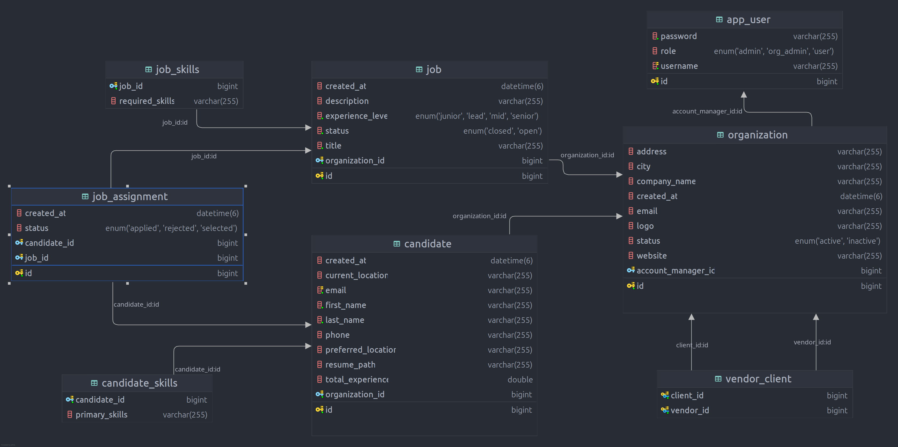

# Recruitr - Spring Boot Recruitment Management System

Recruitr is a Spring Boot application designed to manage organizations, candidates, jobs, and vendor/client assignments. It provides REST APIs and a Swagger UI for easy interaction.

---

## **Requirements**

- Java 21 or higher
- MySQL server **or** Kubernetes cluster

---

## **Setup Instructions**

### **1. Run MySQL Deployment (if using Kubernetes else change url in properties file)**

```bash
kubectl apply -f deployment/
```

### **2. Run Spring Boot Application**

You can run the Spring Boot application using your preferred IDE (IntelliJ, Eclipse, VS Code, etc.) or via command line:

```bash
./mvnw spring-boot:run
```

---

## **Populate Initial Data**

### **Linux / macOS**

```bash
chmod +x init-db.sh
./init-db-data.sh
```

### **Windows**

```cmd
init-db-data.bat
```

> This script will populate organizations, candidates, jobs, and job assignments automatically.

---

## **API Documentation**

- **Swagger UI:** [http://localhost:8080/swagger-ui/index.html](http://localhost:8080/swagger-ui/index.html)
- **OpenAPI docs:** [http://localhost:8080/v3/api-docs](http://localhost:8080/v3/api-docs)

---

## **Default Admin Credentials**

Used for system-level access and initial setup:

- **Username:** `raman`
- **Password:** `admin`

> To change the default admin credentials, update `application.properties`:

```properties
app.admin.username={user}
app.admin.password={pass}
```

> Note: If you change these values, make sure to also update the data initialization scripts accordingly.

---

## **Default Organization Admin Credentials**

| Organization                    | Username                                             | Password          |
| ------------------------------- | ---------------------------------------------------- | ----------------- |
| TalentBridge Staffing Solutions | [hr@talentbridge.com](mailto\:hr@talentbridge.com)   | talentbridge\@123 |
| NextHire Consulting             | [admin@nexthire.com](mailto\:admin@nexthire.com)     | nexthire\@123     |
| Global Edge Staffing            | [admin@globaledge.com](mailto\:admin@globaledge.com) | globaledge\@123   |
| Microsoft Corporation           | [admin@microsoft.com](mailto\:admin@microsoft.com)   | microsoft\@123    |
| Blinkit Technologies Pvt. Ltd.  | [admin@blinkit.com](mailto\:admin@blinkit.com)       | blinkit\@123      |

---

## **Database Schema**

The database schema can be found at:\
`/src/main/resources/static/recruitr@schema.png`

---

## **Design Decisions**

1. **Vendors and Clients:**

    - Implemented as a **bidirectional relationship** to simplify navigation between organizations and their vendors/clients.

2. **Candidates and Jobs:**

    - Connected to the **Organization table** to easily track which organization owns which candidate or job.

3. **Job Assignments:**

    - Implemented as a **separate unidirectional entity** connected to Candidates and Jobs.
    - Avoids redundant references to the organization because it can be inferred via the candidate or job.

> This design keeps the schema clean, avoids unnecessary joins, and maintains clear ownership hierarchies.

---

## **Usage Notes**

- Use the **Swagger UI** to explore all available APIs.
- Populate initial data **before testing APIs** to ensure that organizations, candidates, and jobs exist.
- Candidate and Job IDs used in scripts are **predefined**, ensure scripts are run in order to maintain correct associations.

---
